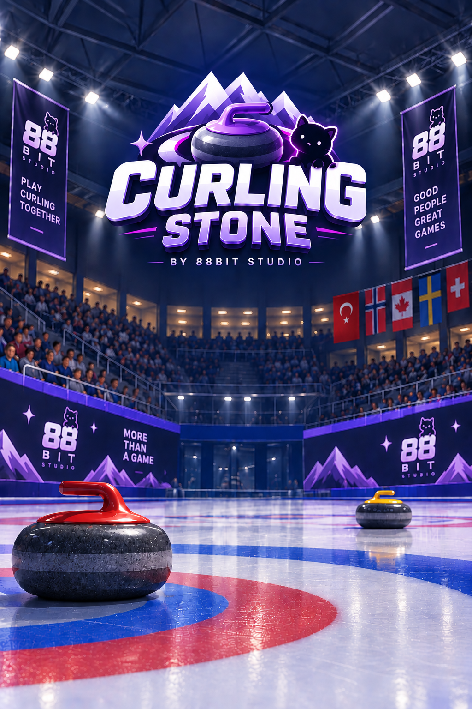

# Curling Stone

  

A mobile curling game built in Unity 6 (URP). Swipe to throw, hold to sweep, play against a friend on the same device or against an AI opponent with three difficulty levels — plus a no-pressure Chill Mode, a cosmetics shop, and a full in-game economy.

## Game Modes

- **Play (vs AI)** — single-player against a computer opponent. Pick Easy / Medium / Hard before the match; the AI aims, calibrates its throw power, sweeps, and can react to blocking stones or go for a takeout shot.
- **Local** — two players, same device. Enter both team names, then alternate turns.
- **Chill Mode** — unlimited, scoreless practice. A fresh stone appears automatically after each throw settles; a Reset button clears the ice.

Each match is `throwsPerPlayer` throws per side (default 4); closest stone to the house center when throws run out wins.

## Core Systems

### Physics & Throwing (`StoneController.cs`)
Two-phase touch input: drag sideways to position the stone, drag back (like drawing a bow) to set throw power, release to throw. While sliding, the stone decelerates on an exponential curve (`iceDeceleration`, with extra braking below `lowSpeedThreshold` so it doesn't crawl forever) and can be steered left/right while sweeping. A full-screen team-colored video plays at the moment of release.

### AI Opponent (`AIOpponent.cs`, `Currency.cs`)
The AI drives the same `StoneController` API a human uses (`AIEnterAimPhase` / `AIRelease` / `AiSweepLeft`/`Right` / `AiSteerDirection`) — no shortcuts, no cheating physics. It calibrates power by simulating the stone's own deceleration formula in code (`StoneController.SimulateStopDistance`) and binary-searching for the throw strength that reaches the target distance, so it stays accurate even if the ice physics get retuned later.

- **Easy** — large aim/power noise, never sweeps.
- **Medium** — moderate noise, sweeps semi-randomly.
- **Hard** — near-exact aim (power is deliberately calibrated a little short so sweeping is genuinely needed to close the gap — otherwise a perfectly-calibrated throw would never need sweeping), reactive sweeping based on projected vs. remaining distance, curls around a blocking stone by aiming to one side and steering back once past it, and will go for a takeout shot on an opponent's stone if it's sitting closer to center than the AI's own best stone.
- Winning a match against the AI pays out coins based on difficulty (`Currency.GetMatchReward`).

### Athletes & Sweeping (`AthleteController.cs`)
Three role-specific characters per side: a throwing athlete (visible only while aiming), and two sweepers that follow the stone laterally with a curved "quarter-circle" path near the ice walls so they never clip through the kickboards. Sweep/walk/idle animations are custom-authored for this rig (`Assets/CharCrafter.../Animations/Custom/`) rather than mixed from different asset-pack sources, so they read as one consistent character.

### Shop & Customize (`CosmeticCatalog.cs`, `ShopUI.cs`, `CustomizeUI.cs`, `Currency.cs`)
Ten wearable head-slot cosmetics (hats, headphones), each rigidly parented to the athlete's Head bone via `AthleteController.EquipCosmetic`. Most are priced in Gold (earned by beating the AI); a few premium items are Diamond-only, which routes the player to the Buy Gold/Diamonds screen (`PayUI.cs`) if they don't have enough — real payment isn't wired up yet, so purchase buttons currently show "Coming soon"; Gold can also be bought with Diamonds directly (a real in-game exchange, no real money involved).

### Localization (`Localization.cs`)
EN/TR/FR/ES. `LocalizedSpriteSet` swaps button art per language; `Localization.Get(key)` covers UI strings that don't have dedicated art. Switching language in Settings reloads the scene so every screen picks up the change uniformly.

### Audio (`MusicManager.cs`, `UISoundManager.cs`)
Persistent (`DontDestroyOnLoad`) music and UI-click managers survive scene reloads. Menu music plays only in the main menu; gameplay is silent by default unless the player has the Headphones cosmetic equipped, in which case a different track plays during matches.

## Key Scripts

| Script | Responsibility |
|---|---|
| `StoneController.cs` | Touch input, throw physics, sweeping, AI-drivable API |
| `TurnManager.cs` | Match flow, scoring, AI turn triggering, win/loss + coin payout |
| `ChillModeManager.cs` | Unlimited-throw practice mode |
| `AIOpponent.cs` | AI aim calibration, strategy, sweep decisions |
| `AthleteController.cs` | Team color, animation state, stone-following, cosmetic equipping |
| `CameraFollowController.cs` | Aim-view / follow-cam / static-view switching |
| `MainMenuUI.cs`, `NameEntryUI.cs`, `DifficultySelectUI.cs`, `SettingsUI.cs` | Menu flow |
| `ShopUI.cs`, `CustomizeUI.cs`, `PayUI.cs`, `CosmeticCatalog.cs`, `CosmeticLoadout.cs`, `Currency.cs` | Shop/economy |
| `GameResultUI.cs` | Win/lose screen, reward panel |
| `Localization.cs` | Language strings & localized sprites |
| `MusicManager.cs`, `UISoundManager.cs` | Audio |

All menu/shop/result screens are built procedurally in code (no prefabs) using a shared `CreateRect`/`CreateImage`/`CreateText` helper pattern per class.

## Known Gaps / Deferred Work

- Real payment (App Store / Play Store IAP) isn't connected — Diamond purchases and Gold-for-money packages are UI-only placeholders.
- TR/FR/ES localized art and strings exist and are wired, but only EN is exposed as default; language switching in Settings is fully functional.
- Clothing-slot cosmetics (Top/Bottom/Feet) were scoped out — only Head-slot items shipped, since the source assets weren't skinned to this rig and would need proper rigging work to fit well.

## License

The source code in `Assets/Scripts/` is released under the [MIT License](LICENSE).

**Third-party content is not covered by that license.** This repository also
contains assets from external packs, each governed by its own terms:

| Path | Source | Terms |
|---|---|---|
| `Assets/CharCrafter – Free Preset Characters Pack (Vol. 1)/` | Unity Asset Store | Asset Store EULA |
| `Assets/Magic VFX/Magic VFX - Ice (FREE)/` | Unity Asset Store | Asset Store EULA |
| `Assets/EmaceArt/` | Unity Asset Store | Asset Store EULA |
| `Assets/Plugins/GamePeek/` | GamePeek (editor plugin) | Vendor terms |
| `Assets/TextMesh Pro/` | Unity | Unity package license |
| Mixamo animation clips | Adobe Mixamo | Mixamo terms |

Redistributing those packs — including by publishing this repository — is
generally **not** permitted by the Unity Asset Store EULA. Before making this
repository public, either remove the third-party asset folders or keep the
repository private.
